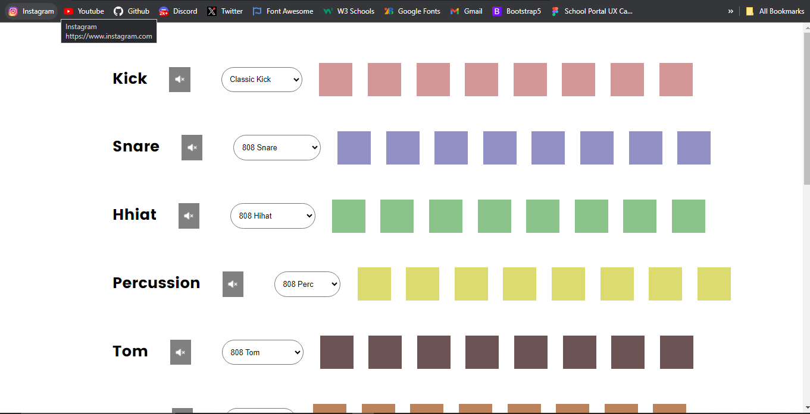
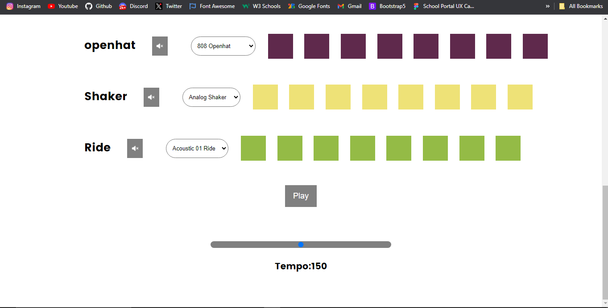

# README beatmaker

Beatmaker Web App README




# Introduction

Welcome to this simple beatmaker web app i created with HTML, CSS & Javascript.

- By clicking on the pads and the play button you can create your beats.

- You can view the app live at: https://hallowdread.github.io/beatmaker/

# Features:

- The app create beats using a user-friendly and responsive beat editor.

- Ability to mix and preview your beats in real-time.

- Adjust the tempo to your desired taste.

# Prerequisites:

Before you begin, ensure you have met the following requirements:

- Have a working web browser (e.g., Chrome, Firefox, Safari).
- Internet connection to access the app.

# Installation:

To run the Beatmaker Web App locally, follow these steps:

1. Clone the repository to your local machine:

```
git clone https://github.com/yourusername/beatmaker.git
```

2. Navigate to the project directory:

```
cd beatmaker
```

3. Open the index.html file in your preferred web browser:

```
open index.html
```

With this process the app should now be up and running on your local machine.

# Usage:

- Launch the application by opening the index.html file.

- Use the intuitive beatmaker to create your beats by clicking on the color pads.

- The active (the pad that brings out the sound) pad diplays a brighter color when clicked on.

- The you can hear your sounds by clicking the play button below and if you want to stop the sound you can also click the same button.

- Adjust the tempo to your suitable taste.

- Preview and mix your beats in real-time.

# Contributing:

I welcome contributions to improve and expand this project. If you'd like to contribute, please follow these steps:

- Fork the repository

- Create a new branch for your feature or bug fix.

- Make your changes, commit them, and push to your fork.

- Submit a pull request to the main repository.

Thank You....
